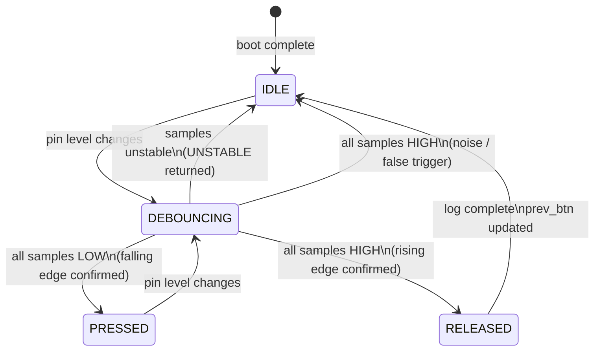

# Application Guide
 
This document explains what the demo application does, how its logic is
structured, and why each design decision was made. It covers application
states, the state machine, timing behaviour, and how the drivers are
orchestrated. It does not repeat the driver API — see `API_REFERENCE.md`
for that.
 
---
 
## What the Application Does
 
The application turns the CH32V003's onboard button (PD4) into a toggle
switch for the onboard LED (PD6). Each confirmed button press flips the
LED state. Every press and release is logged to a host terminal over UART
with a timestamp (milliseconds since boot) and, on release, the duration
the button was held.
 
---
 
## Application States
 
The application operates in four logical states at any point in time:
 
| State        | Description                                                       |
|--------------|-------------------------------------------------------------------|
| `IDLE`       | Button is not pressed. LED holds its current state. Loop polls.   |
| `DEBOUNCING` | Pin level changed but samples are not yet stable. No action taken.|
| `PRESSED`    | Button confirmed held LOW. LED toggled. Press event logged.       |
| `RELEASED`   | Button confirmed returned HIGH. Hold duration logged.             |
 
There is no explicit mode switching in this application — it has a single
operating mode (button-toggle-LED). The states above describe the button
input lifecycle within that single mode.
 
---
 
## State Machine
 
The following diagram shows how the application transitions between states
based on debounce results and edge detection:
 

 
**State transition rules:**
 
| From         | To           | Condition                                      | Action                          |
|--------------|--------------|------------------------------------------------|---------------------------------|
| `IDLE`       | `DEBOUNCING` | `gpio_debounce_read()` called, pin changed     | None                            |
| `DEBOUNCING` | `IDLE`       | Samples disagree — `UNSTABLE` returned         | `continue` — skip iteration     |
| `DEBOUNCING` | `PRESSED`    | All samples LOW, `prev_btn` was HIGH           | Toggle LED, log press           |
| `DEBOUNCING` | `IDLE`       | All samples HIGH, `prev_btn` was HIGH          | No edge — stay idle             |
| `PRESSED`    | `DEBOUNCING` | Pin level changes again                        | None                            |
| `DEBOUNCING` | `RELEASED`   | All samples HIGH, `prev_btn` was LOW           | Compute hold, log release       |
| `RELEASED`   | `IDLE`       | `prev_btn` updated to HIGH                     | Ready for next press            |
 
---
 
## Application State Variables
 
The application tracks four pieces of state between loop iterations:
 
| Variable      | Type         | Initial Value | Purpose                                                    |
|---------------|--------------|---------------|------------------------------------------------------------|
| `prev_btn`    | `uint8_t`    | `GPIO_HIGH`   | Last confirmed debounced button level — used for edge detection |
| `led_state`   | `uint8_t`    | `GPIO_LOW`    | Current LED level — toggled on each confirmed press        |
| `press_count` | `uint32_t`   | `0`           | Cumulative confirmed press count since boot                |
| `press_time`  | `uint32_t`   | `0`           | `millis` value at last press — used to compute hold duration |
 
`prev_btn` is initialised to `GPIO_HIGH` because the button uses a pull-up
resistor — the unpressed resting state is HIGH. Initialising to `GPIO_LOW`
would cause a false release event on the first loop iteration.
 
---
 
## Initialisation Sequence
 
Peripherals are initialised in this specific order:
 
```
1. systick_init()              — 1 ms time base active before any timing
2. uart_init(115200)           — UART ready before first log message
3. gpio_init(PD6, OUTPUT)      — LED pin configured
4. gpio_init(PD4, INPUT_PU)    — Button pin configured with pull-up
5. gpio_write(PD6, LOW)        — LED explicitly OFF at startup
6. Startup banner printed      — Confirms all peripherals initialised
```
 
Order matters for two reasons:
 
- SysTick must be first because `millis` is read in log messages
  immediately after `uart_init()`. Without SysTick running, all timestamps
  would read 0.
- UART must be second so the startup banner can confirm every peripheral
  as it comes online. If GPIO were initialised before UART, any GPIO
  configuration error would occur silently with no log output.
---
 
## Main Loop Logic
 
The main loop runs continuously with no sleep or delay. Each iteration:
 
```
1. Call gpio_debounce_read(PORT_D, BTN_PIN, 5)
   Result is one of: UNSTABLE | GPIO_HIGH | GPIO_LOW
 
2. If UNSTABLE
   → continue  (skip remaining logic, prev_btn unchanged)
 
3. If btn == GPIO_LOW AND prev_btn == GPIO_HIGH
   → Falling edge = button just pressed
   → press_count++
   → press_time = timer_get_millis()
   → led_state = !led_state
   → gpio_write(PORT_D, LED_PIN, led_state)
   → uart_print press number, timestamp, LED state
 
4. If btn == GPIO_HIGH AND prev_btn == GPIO_LOW
   → Rising edge = button just released
   → hold = timer_get_millis() - press_time
   → uart_print release timestamp, hold duration
 
5. prev_btn = btn
```
 
The loop has no `delay()`. It runs as fast as the debounce read allows
(~160 µs per call when stable), sampling the button approximately 6000
times per second.
 
---
 
## How Drivers Are Orchestrated
 
The application uses three drivers. Each has a distinct role and is called
at a specific point in the loop:
 
| Driver  | Functions Used                              | When Called                        | Purpose                              |
|---------|---------------------------------------------|------------------------------------|--------------------------------------|
| GPIO    | `gpio_init()`                               | Once at startup                    | Configure LED and button pins        |
| GPIO    | `gpio_debounce_read()`                      | Every loop iteration               | Sample button with debounce          |
| GPIO    | `gpio_write()`                              | On falling edge only               | Update LED state                     |
| UART    | `uart_init()`                               | Once at startup                    | Configure USART1                     |
| UART    | `uart_print()`, `uart_println()`            | Once at startup (banner)           | Print initialisation log             |
| UART    | `uart_print()`, `uart_print_num()`          | On falling edge and rising edge    | Log press and release events         |
| SysTick | `timer_get_millis()`                        | On falling edge and rising edge    | Read timestamp for logging           |
 
The application never accesses hardware registers directly. Every hardware
operation goes through one of these driver calls. This means the entire
application logic in `main.c` is portable — changing the target pin
requires only editing constants in `gpio.h`.
 
---

## Timing Behaviour

### SysTick

The SysTick interrupt fires every 1 ms and increments `millis`. The ISR is declared with `__attribute__((interrupt("WCH-Interrupt-fast")))`, which is WCH's vendor-specific fast-interrupt attribute. It causes the core to save only the minimal register context, reducing ISR entry/exit overhead to a few cycles. The ISR clears `SysTick->SR` (the compare match flag) immediately to prevent re-entry.

### Debounce timing

Each call to `gpio_debounce_read()` with `samples = 5` takes approximately 160–170 µs of blocking execution. This time is dominated by four busy-wait gaps of 1000 loop iterations each at 24 MHz. During this time, no other work is done and `millis` continues incrementing normally (SysTick is interrupt-driven and is not blocked by the busy-wait).

### UART transmission time

At 115200 baud, each character takes approximately 87 µs. A typical log line such as `[PRESS]   #3  |  t = 12450 ms  |  LED = ON` is 45 characters, taking approximately 3.9 ms to transmit. During this time, the main loop is blocked inside `uart_print*` calls. This means a press event that arrives while a log line is being transmitted will be detected on the next iteration after the UART call returns, with a timestamping error of at most ~4 ms. This is acceptable for a human-interaction demo.

---

## Edge Cases Handled

### Mechanical bounce

`gpio_debounce_read()` returns `GPIO_DEBOUNCE_UNSTABLE` while the pin is in a bouncing state. The main loop checks for this and calls `continue`, skipping both edge detection and `prev_btn` update. This means bounce transitions are invisible to the application: `prev_btn` retains its last confirmed value until the pin settles.

Without this, a single button press could easily generate 5–20 rapid HIGH/LOW transitions, each triggering a toggle, leaving the LED in an unpredictable state.

### Rapid repeated presses

Each call to `gpio_debounce_read()` is independent. If the button is pressed and released in under 1 ms (faster than human capability), the falling and rising edges will both be detected on successive loop iterations, provided the debounce samples agree on each call. In practice, human presses last at least 50 ms, so this is not a real concern.

### First press after boot

`prev_btn` is initialised to `GPIO_HIGH` (released state). This is correct because the button is wired with a pull-up: when not pressed, PD4 reads HIGH. If `prev_btn` were initialised to `GPIO_LOW`, the first debounce read returning HIGH would trigger a false "release" event before any button was ever pressed.

### Counter overflow

`press_count` is `uint32_t`, giving a range of 0 to 4,294,967,295 presses. At one press per second continuously, this would overflow in approximately 136 years. No overflow handling is needed.

### `millis` overflow

`millis` is `volatile uint32_t` and will wrap at 4,294,967,295 ms (approximately 49.7 days of uptime). The hold duration calculation `millis - press_time` uses unsigned subtraction, which gives the correct result even across a wrap boundary (e.g., if `millis = 5` and `press_time = 4294967290`, the result is `5 - 4294967290 = 11` in unsigned 32-bit arithmetic, which is correct). Timestamps in log messages will reset to small values after wraparound, which is expected and not harmful.