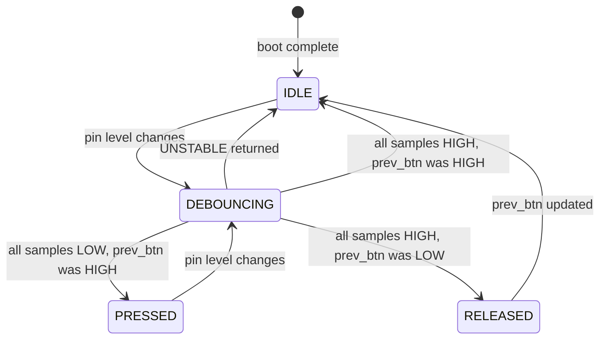

# Application Guide

What the application does, how its states are defined, and how the drivers
are orchestrated. For driver API details see `API_REFERENCE.md`.

---

## What the Application Does

Press the onboard button (PD4) to toggle the LED (PD6). Each confirmed
press and release is logged over UART with a millisecond timestamp. On
release, the hold duration is also printed.

---

## Application States

| State        | Description                                                      |
|--------------|------------------------------------------------------------------|
| `IDLE`       | Button unpressed. LED holds state. Loop polls continuously.      |
| `DEBOUNCING` | Pin changed but samples not yet stable. No action taken.         |
| `PRESSED`    | Button confirmed LOW. LED toggled. Press event logged.           |
| `RELEASED`   | Button confirmed HIGH. Hold duration computed and logged.        |

---

## State Machine



**Transition table:**

| From         | To         | Condition                             | Action                    |
|--------------|------------|---------------------------------------|---------------------------|
| `IDLE`       | `DEBOUNCING` | Pin level changed                   | None                      |
| `DEBOUNCING` | `IDLE`     | UNSTABLE returned                     | `continue`                |
| `DEBOUNCING` | `PRESSED`  | All LOW, prev_btn HIGH                | Toggle LED, log press     |
| `DEBOUNCING` | `IDLE`     | All HIGH, prev_btn HIGH               | No edge — stay idle       |
| `PRESSED`    | `DEBOUNCING` | Pin changes again                   | None                      |
| `DEBOUNCING` | `RELEASED` | All HIGH, prev_btn LOW                | Compute hold, log release |
| `RELEASED`   | `IDLE`     | prev_btn updated                      | Ready for next press      |

---

## Application State Variables

| Variable      | Type       | Initial     | Purpose                                     |
|---------------|------------|-------------|---------------------------------------------|
| `prev_btn`    | `uint8_t`  | `GPIO_HIGH` | Last confirmed level — used for edge detection |
| `led_state`   | `uint8_t`  | `GPIO_LOW`  | Current LED level                           |
| `press_count` | `uint32_t` | `0`         | Cumulative press count since boot           |
| `press_time`  | `uint32_t` | `0`         | `millis` at last press — for hold duration  |

`prev_btn` starts HIGH because the pull-up holds PD4 HIGH when unpressed.
Starting it LOW would generate a false release event on the first iteration.

---

## Initialisation Sequence

```
1. systick_init()           — millis must run before any timestamp is read
2. uart_init(115200)        — UART ready before the first log message
3. gpio_init(PD6, OUTPUT)   — LED configured
4. gpio_init(PD4, INPUT_PU) — Button configured with pull-up
5. gpio_write(PD6, LOW)     — LED explicitly OFF at startup
6. Print banner             — Confirms all peripherals online
```

SysTick first because `millis` is read in the banner. UART second so any
initialisation problem is visible in the log rather than silent.

---

## Main Loop Logic

```
1. btn = gpio_debounce_read(PORT_D, BTN_PIN, 5)

2. UNSTABLE  → continue

3. btn==LOW, prev_btn==HIGH (falling edge)
   → press_count++
   → press_time = timer_get_millis()
   → led_state = !led_state
   → gpio_write(PORT_D, LED_PIN, led_state)
   → log press number, timestamp, LED state

4. btn==HIGH, prev_btn==LOW (rising edge)
   → hold = timer_get_millis() - press_time
   → log release timestamp, hold duration

5. prev_btn = btn
```

No `delay()`. Runs ~6000 iterations per second when the pin is stable.

---

## How Drivers Are Orchestrated

| Driver  | Function                          | When                        | Purpose                    |
|---------|-----------------------------------|-----------------------------|----------------------------|
| GPIO    | `gpio_init()`                     | Once at startup             | Configure LED and button   |
| GPIO    | `gpio_debounce_read()`            | Every loop iteration        | Sample button              |
| GPIO    | `gpio_write()`                    | Falling edge only           | Update LED                 |
| UART    | `uart_init()`                     | Once at startup             | Configure USART1           |
| UART    | `uart_print/println()`            | Startup + each edge         | Log events                 |
| SysTick | `timer_get_millis()`              | Each edge                   | Timestamps and hold time   |

No hardware register is accessed directly in `main.c`.

---

## Timing Behaviour

**SysTick:** Fires every 1 ms, increments `millis`. Uses
`WCH-Interrupt-fast` attribute to minimise context save overhead.
Not blocked by busy-wait in debounce — interrupt-driven and independent.

**Debounce:** 5 samples × ~40 µs gaps = ~160 µs blocking per call.
Returns UNSTABLE during the bounce window (~1–20 ms for mechanical buttons)
so the loop retries harmlessly until the pin settles.

**UART:** ~87 µs per byte at 115200 baud. A 45-character log line takes
~3.9 ms. A press event during transmission is detected on the next
iteration with at most ~4 ms timestamp error — acceptable for human
interaction.

---

## Edge Cases

**Bounce:** UNSTABLE skips edge detection and leaves `prev_btn` unchanged.
A single physical press cannot generate multiple toggles.

**millis wraparound:** `millis` wraps at ~49.7 days. Hold duration uses
unsigned subtraction — correct across the boundary. For example:
`release=5, press=4294967290` gives `11` in uint32 arithmetic, which
is the correct 11 ms hold time.