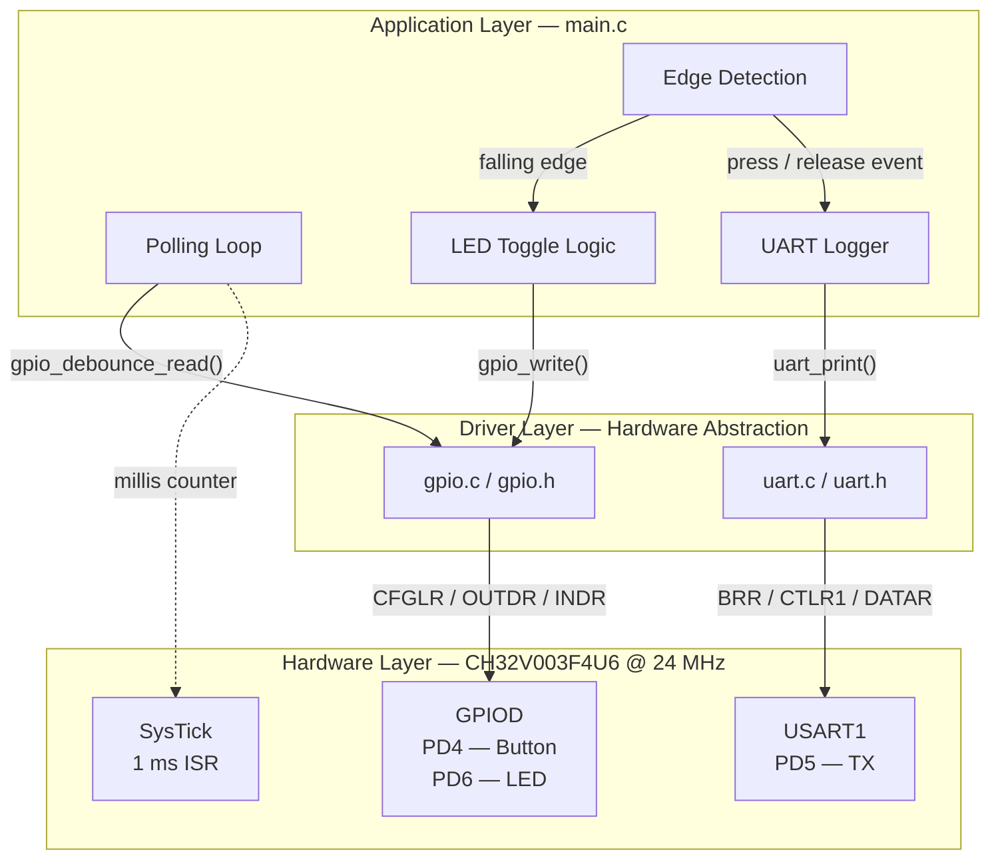
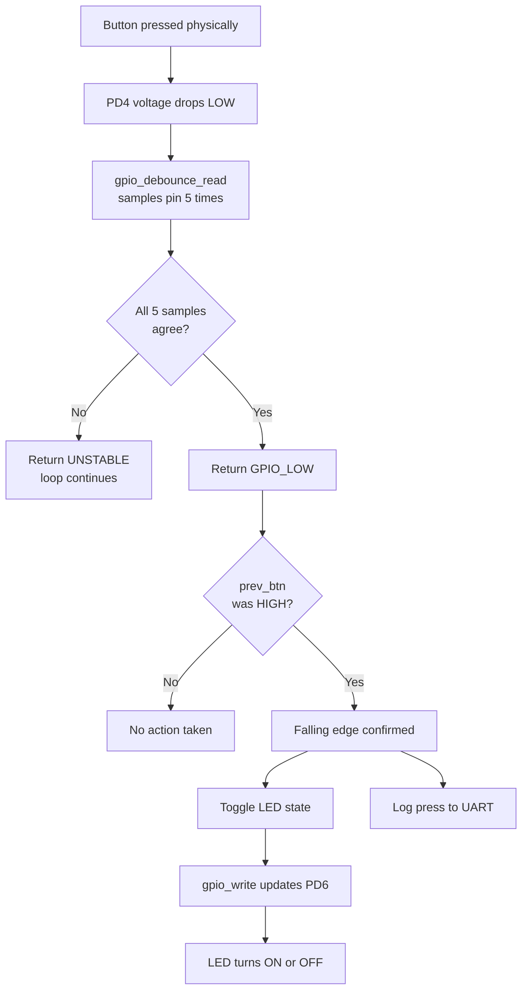
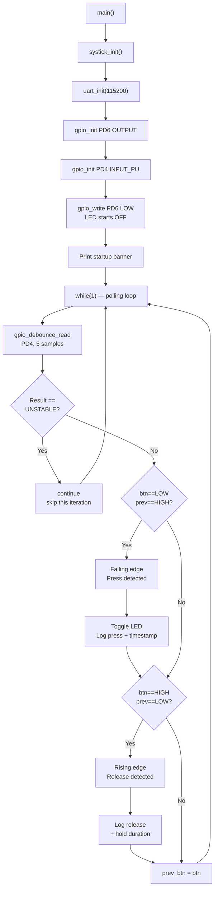

# System Architecture

## Overview

The project is structured as a two-layer firmware stack. The bottom layer contains hardware drivers. The top layer contains the application. The two layers communicate only through the driver API; the application never accesses hardware registers directly.

## Layer Descriptions

### Hardware Layer

The CH32V003F4U6 is a 32-bit RISC-V microcontroller running at 24 MHz from its internal HSI RC oscillator. The peripherals used in this project are:

- **GPIOD:** Three pins are used. PD4 reads the button (input with pull-up), PD5 drives the UART TX line (alternate function), and PD6 drives the onboard LED (push-pull output).
- **USART1:** Clocked from APB2 (same as HCLK = 24 MHz in this configuration). Baud rate is set by dividing this clock by a value written to `BRR`.
- **SysTick:** A 32-bit up-counter built into the RISC-V core. Configured with a compare value of 23999 (24000 - 1) to generate a match interrupt every 1 ms.

### Driver Layer

**GPIO driver (`gpio.c`):**

The CH32V003 configures each GPIO pin using 4 bits inside the `CFGLR` register. The `gpio_init()` function calculates the correct nibble for each requested mode and writes it via a clear-then-set pattern to avoid disturbing adjacent pins. The enable function for APB2 clocks is handled by a private `enable_clock()` helper inside `gpio.c`; it is not exposed in the header because the application has no reason to manage clocks directly.

The debounce filter (`gpio_debounce_read`) is implemented entirely in software using repeated calls to the base `gpio_read()` with busy-wait delays between samples. No hardware timer is used for debounce. This is a deliberate design choice: it keeps the debounce logic self-contained within the GPIO driver without requiring a timer peripheral, and the blocking time (~160 µs) is acceptable in a polling loop.

**UART driver (`uart.c`):**

USART1 is configured in the simplest possible way for one-way debug output: transmitter only, 8 data bits, no parity, 1 stop bit (8N1), blocking transmission. All `uart_print*` functions call down to `uart_send_byte()`, which polls the `TXE` flag in `STATR` before writing each byte to `DATAR`. There is no interrupt-driven TX buffer or DMA — the UART is only used for logging at human-readable rates, so blocking is acceptable.

**SysTick (in `main.c`, not a separate driver):**

SysTick is configured directly in `main.c` rather than as a library module. This is intentional: SysTick is a core-private peripheral belonging to the application, not a reusable driver in the same way as GPIO or UART. The `millis` counter it increments is a global `volatile uint32_t`.

### Application Layer

`main.c` contains all application logic. It has three responsibilities:

1. **Initialise all drivers** in the correct order (SysTick first, then UART so the banner can be printed, then GPIO).
2. **Run the polling loop**, which calls `gpio_debounce_read()` every iteration to sample the button.
3. **Detect edges** by comparing the current debounce result against the previous confirmed state, and acting on falling edges (press) and rising edges (release).

---

## Data Flow

# Control Flow

## Why This Architecture Was Chosen

**No RTOS, no interrupts for GPIO/UART:** At this project's scale (one button, one LED, one serial log), a cooperative polling loop is simpler, more predictable, and easier to debug than an interrupt-driven design. Every state transition is visible in a single execution path through `main()`.

**Strict API boundary:** By banning direct register access from `main.c`, the driver can be ported to a different CH32V003 board simply by changing pin number constants in `gpio.h`. The application code requires no modification.

**Blocking UART:** Blocking TX is appropriate here because the application is not time-critical. Log lines are short, UART runs at 115200 baud, and the polling loop easily tolerates the ~0.9 ms it takes to transmit a typical 12-character log line. A non-blocking UART with an interrupt-driven TX buffer would add complexity without any observable benefit.

**Software debounce in the driver, not the application:** Debounce is a property of how you read a mechanical input, not a property of what you do with the reading. Placing `gpio_debounce_read()` inside the GPIO driver means any future application that uses a button gets debounce for free.
