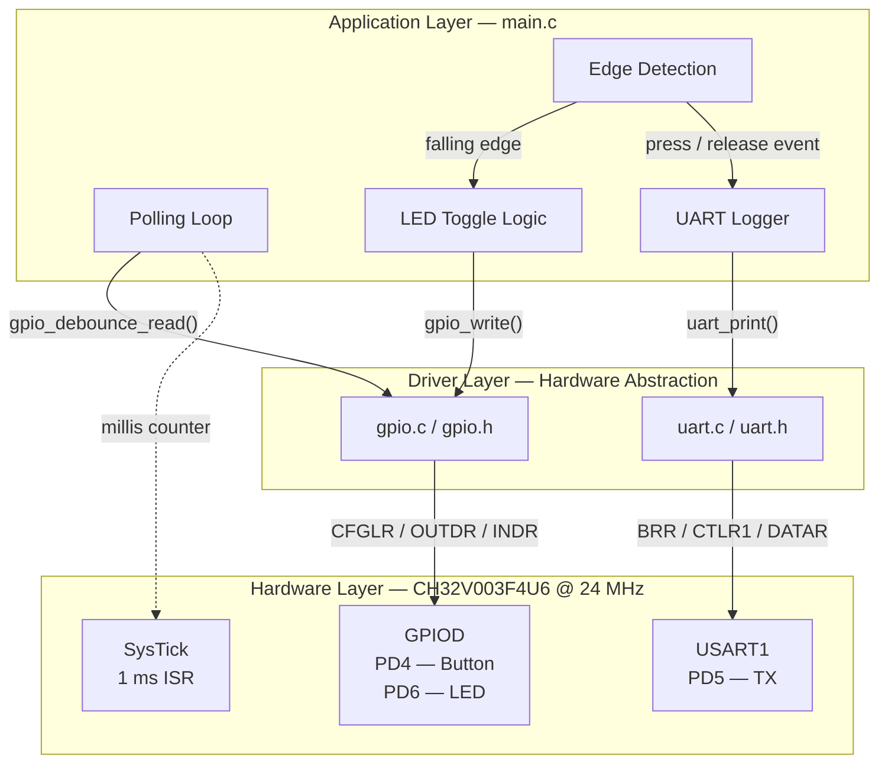
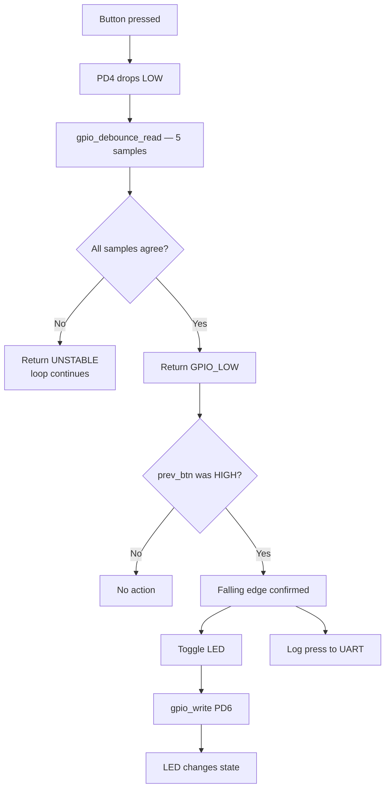
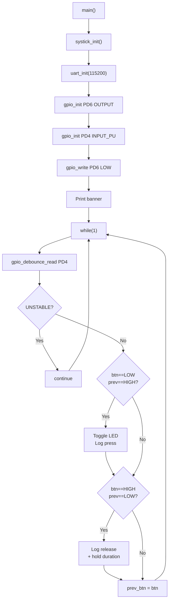

# System Architecture

## Overview

Two-layer firmware stack. Drivers sit below the application. The application
communicates with hardware exclusively through driver API calls — no direct
register access in `main.c`.

---

## High-Level Block Diagram



---

## Layer Descriptions

### Hardware Layer

CH32V003F4U6 at 24 MHz from the internal HSI RC oscillator.

- **GPIOD** — PD4 (button, pull-up input), PD5 (UART TX, alt function),
  PD6 (LED, push-pull output).
- **USART1** — Clocked from APB2 at 24 MHz. Baud rate set by `BRR`.
- **SysTick** — Core-private 32-bit counter. Compare value 23999 generates
  a 1 ms interrupt to increment `millis`.

### Driver Layer

**GPIO (`gpio.c`):** Each pin is configured by writing a 4-bit nibble into
`CFGLR`. `gpio_init()` uses a clear-then-set pattern to avoid disturbing
adjacent pins. APB2 clock enabling is handled by a private `enable_clock()`
helper — not exposed in the header because the application has no reason to
manage clocks directly. Debounce is implemented entirely in software within
the driver so any application using a button gets it for free.

**UART (`uart.c`):** USART1 configured TX-only, 8N1, blocking. Polling the
`TXE` flag before each byte write is sufficient at 115200 baud for debug
logging.

### Scheduler / Event System

No RTOS. A single SysTick ISR fires every 1 ms and increments `millis`:

```
SysTick ISR (1 ms)
└── millis++   ← volatile uint32_t
```

Declared with `__attribute__((interrupt("WCH-Interrupt-fast")))` to save
only minimal register context. Clears `SysTick->SR` immediately to prevent
re-entry. `millis` drives press timestamps and hold duration calculation.
GPIO and UART are both polled — no other interrupt sources.

### Application Layer

`main.c` does three things: initialises drivers in the correct order,
runs the polling loop, and detects button edges by comparing the current
debounce result against `prev_btn`.

---

## Data Flow



---

## Control Flow



---

## Why This Architecture

**Polling over interrupts:** One button, one LED, one log interface — a
polling loop is simpler and every state transition is visible in one
execution path through `main()`.

**Strict API boundary:** `main.c` never touches registers. Porting to a
different CH32V003 board means changing pin constants in `gpio.h` only.

**Debounce in the driver:** Debounce is a property of how you read a
mechanical input, not what you do with the result. Keeping it in the GPIO
driver means the application doesn't need to implement it.

**Blocking UART:** Log lines are short, the loop tolerates ~3.9 ms per
line at 115200 baud, and a non-blocking TX buffer would add complexity
with no observable benefit.

**SysTick in `main.c`:** SysTick is the application's time reference, not
a reusable peripheral driver. Keeping it in `main.c` reflects that clearly.